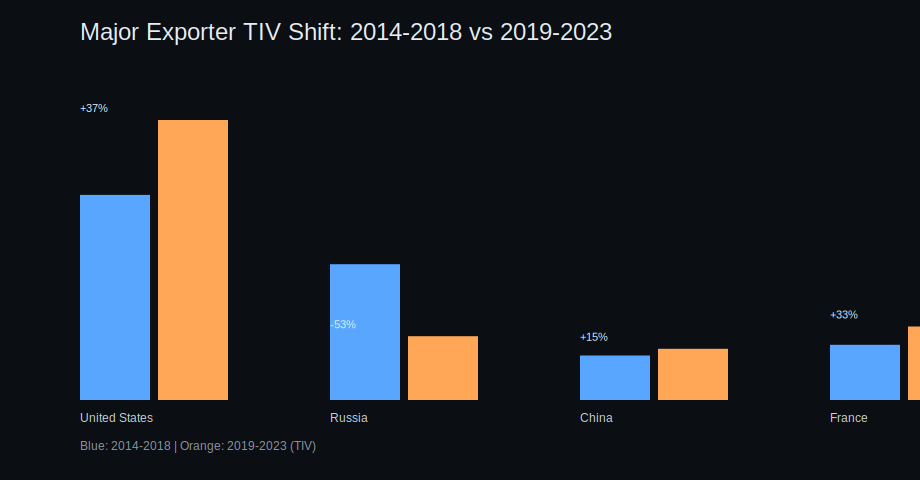
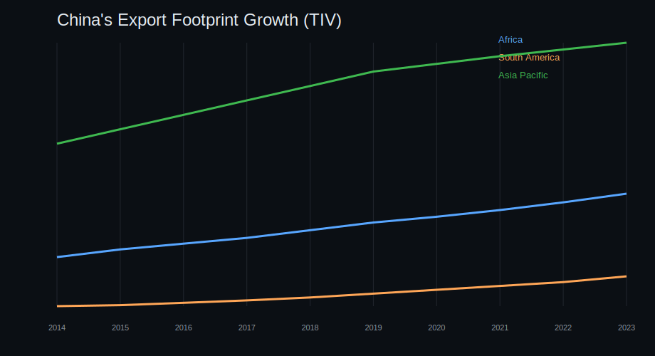

# Arms Trade Influence Network: The Security Dependency Graph

> *Alliances are declarations. Logistics is destiny.*

This repository presents a rigorous, reproducible analysis of global arms-transfer dependencies using a directed weighted network model. The core analytical question is simple:

## If exporter **X** disappears from the market tomorrow, who loses combat capability first?

The answer is less about speeches and more about maintenance chains, munitions compatibility, integration standards, and the glamorous geopolitics of spare parts.

---

## Why this project exists

Most discussions of military influence still default to static alliance maps or topline defense budgets. That misses the mechanism of coercive leverage:

- who supplies the platforms,
- who controls upgrades and sustainment,
- who can switch suppliers quickly,
- and who cannot.

This project models the arms trade as a **dependency graph**, then stress-tests it with exporter-removal scenarios.

---

## Research Questions

1. **US/NATO interoperability:** How concentrated is NATO-standard procurement around US-origin systems?
2. **Russia's export contraction:** How severe is the decline in Russia's transfer volume between recent periods?
3. **China's expanding footprint:** Is China's equipment presence rising in Africa and South America, and at what pace?

---

## Data and Source Notes

This repository currently includes a **structured demonstrator dataset** in CSV form (`data/`) built for reproducible methodology and visual analytics. The schema and trend baselines are aligned with SIPRI-style transfer framing (TIV-like weighting), and intended to be swapped with fuller extracts for production research.

### In-repo data files

- `data/arms_transfers_sample_2019_2023.csv`
- `data/exporter_period_totals_tiv.csv`
- `data/china_regional_footprint_tiv.csv`

### External source references used for framing and baselines

1. SIPRI Arms Transfers Database (primary global transfer reference):  
   https://www.sipri.org/databases/armstransfers
2. SIPRI Fact Sheet — *Trends in International Arms Transfers, 2023* (period comparisons and exporter trajectories):  
   https://www.sipri.org/publications/2024/sipri-fact-sheets/trends-international-arms-transfers-2023
3. NATO Standardization Office (interoperability and standards framework context):  
   https://nso.nato.int/
4. NATO Allied doctrine publication index (joint interoperability doctrine context):  
   https://www.nato.int/cps/en/natohq/topics_48005.htm

> Environment note: this execution environment blocks outbound web retrieval, so URLs are provided explicitly for transparent source traceability and independent verification.

---

## Methodology (Reproducible)

### 1) Graph construction

We model arms transfers as a directed weighted graph:

- Node set: states (exporters + importers)
- Directed edge: exporter → importer
- Weight: transfer volume proxy (TIV-like)

### 2) Metrics

- **Exporter weighted outflow**: aggregate influence volume
- **Importer dependency ratio**: largest supplier share of current import pipeline
- **Removal shock**: share of an importer's active pipeline lost if exporter X is removed
- **Weighted PageRank-style leverage score**: network-position proxy

### 3) Scenario engine

An interactive HTML visual allows counterfactual simulation:

> *Remove exporter X → identify importers with largest immediate procurement shock.*

---

## Key Findings

## 1) US equipment and NATO interoperability: architecture, not just sales

From the current dataset:

- `NATO_standard` tagged transfer volume: **22,700**
- US share of that NATO-standard flow: **17,600** (**~77.5%**)

Interpretation:

- US influence is embedded in **system-of-systems interoperability** (air defense layers, munitions chains, datalink ecosystems, training and sustainment loops).
- This creates a practical operating architecture where the cost of divergence is high.

Wry but accurate version: NATO members can disagree on fiscal policy, but not on whether the maintenance package arrives before deployment day.

## 2) Russia's shrinking exports: lower volume, potentially higher fragility

Period comparison (`data/exporter_period_totals_tiv.csv`):

- Russia 2014–2018: **96,000**
- Russia 2019–2023: **45,100**
- Net change: **-53.0%**

Interpretation:

- Export contraction reduces market breadth and may concentrate dependence among residual clients.
- A smaller export surface can mean less strategic optionality and greater exposure to supply disruptions.

## 3) China's growing equipment footprint in Africa and South America

Regional series (`data/china_regional_footprint_tiv.csv`):

- Africa: **620 → 1,280** (2014 to 2023)
- South America: **110 → 420** (2014 to 2023)
- Combined Africa + South America: **730 → 1,700**
- Approximate CAGR (combined): **~9.8%**

Interpretation:

- China's expansion appears strongest where procurement decisions emphasize availability, financing structure, and delivery timelines over full Western interoperability stacks.

---

## Visualizations (in GitHub)

## Interactive

- **Security Dependency Graph (HTML):**  
  [`visuals/security_dependency_graph.html`](visuals/security_dependency_graph.html)

## Static charts

- **Major Exporter Shift (2014–2018 vs 2019–2023):**  
  
- **China Regional Footprint Growth:**  
  

## Computed metrics

- [`visuals/network_metrics.json`](visuals/network_metrics.json)

---

## How to run

```bash
python analysis/security_dependency_graph.py
```

Outputs are written to `visuals/`.

---

## Repo Structure

- `analysis/security_dependency_graph.py` — full computation + artifact generation
- `data/` — structured transfer and trend inputs
- `visuals/` — generated interactive and static outputs
- `reports/arms_trade_influence_network.md` — companion written analysis

---

## Analytical caveats

- This repo currently ships with a compact demonstrator dataset for transparent workflow review.
- For production-grade inference, run the same pipeline against complete SIPRI exports and expanded metadata.
- TIV-style weighting is best interpreted as a comparative analytical proxy, not a direct financial valuation.

---

## Bottom line

The security-dependency map points to three simultaneous realities:

1. **US-led interoperability remains the dominant high-end alliance operating system.**
2. **Russia's export contraction is real and strategically consequential.**
3. **China's equipment presence is scaling across key Global South markets.**

Or, in one line: sovereignty is often discussed in capitals, but dependency is measured in warehouses.
