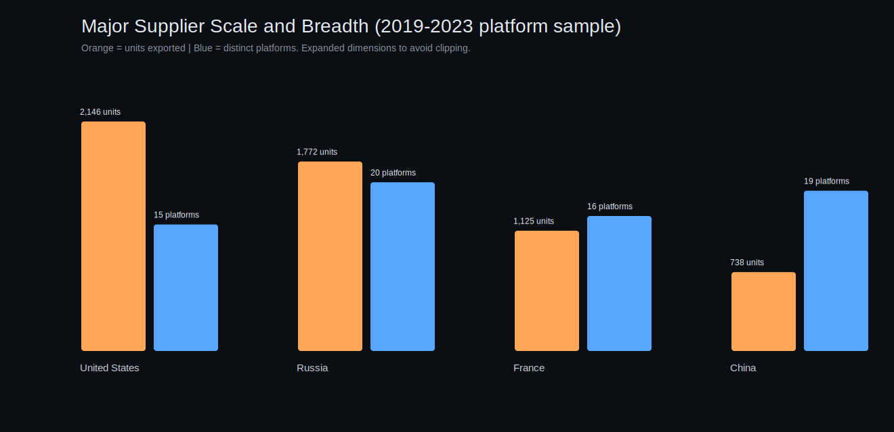
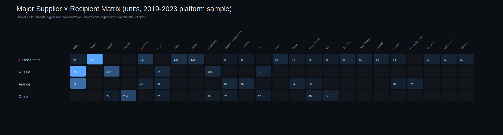

# Arms Trade Influence Network: The Security Dependency Graph

This repository presents a rigorous, reproducible analysis of global arms-transfer dependencies using a directed weighted network model.

## Core question

**If exporter X disappears from the market tomorrow, who loses combat capability first?**

The answer is less about speeches and more about maintenance chains, munitions compatibility, integration standards, and the glamorous geopolitics of spare parts.

---

## Why this project exists

Most discussions of military influence still default to static alliance maps or topline defense budgets. Those are visually satisfying and analytically comforting — and operationally incomplete.

Combat power in the real world is a function of:

- software baselines,
- depot-level maintenance access,
- certified munitions compatibility,
- trained personnel pipelines,
- upgrade pathways,
- and the ability to keep a platform mission-capable on day 400 of a war, not day 4 of a press conference.

What this project measures is not alignment, but **sustainment gravity**.

Influence in this model is not who signs communiqués together — it is who cannot generate sorties when the containers stop arriving.

---

## Analytical framing

I treat the global arms trade as a live dependency structure, not a historical ledger.

In practical terms:

- I am not asking who bought the most.
- I am asking who is now structurally unable to fight the same way without a specific supplier.

This shifts the conversation from diplomacy to logistics, which is where coercive leverage actually lives.

---

## Research Questions

1. **US/NATO interoperability:** How concentrated is NATO-standard procurement around US-origin systems, and what does that imply for coalition warfighting continuity?
2. **Russia's export contraction:** Does the decline in Russian transfer volume reduce influence, or create tighter (and more brittle) dependency clusters?
3. **China's expanding footprint:** Is China's growth occurring in marginal markets, or producing durable security relationships in regions outside its historical equipment ecosystem?
4. **Platform-scale dependency:** Across US, Russia, France, and China, which platforms are being exported at scale, and to whom?

---

## Data and source notes

This repository includes a structured demonstrator dataset in CSV form (`data/`) built for reproducible methodology and visual analytics. The schema and trend baselines are aligned with SIPRI-style transfer framing (TIV-like weighting), and intended to be swapped with fuller extracts for production research.

### In-repo data files

- `data/arms_transfers_sample_2019_2023.csv`
- `data/exporter_period_totals_tiv.csv`
- `data/china_regional_footprint_tiv.csv`
- `data/platform_exports_major_suppliers_2019_2023.csv`

### External references for framing and baselines

- SIPRI Arms Transfers Database: https://www.sipri.org/databases/armstransfers
- SIPRI Fact Sheet — *Trends in International Arms Transfers, 2023*: https://www.sipri.org/publications/2024/sipri-fact-sheets/trends-international-arms-transfers-2023
- NATO Standardization Office: https://nso.nato.int/
- NATO doctrine/publication index: https://www.nato.int/cps/en/natohq/topics_48005.htm

> Environment note: outbound web retrieval is blocked in this runtime (HTTP 403). Sources are cited with direct URLs for transparent verification.

---

## Methodology (Reproducible)

### 1) Graph construction

Arms transfers are modeled as a directed weighted graph:

- Node set: states (exporters + importers)
- Directed edge: exporter → importer
- Weight: transfer volume proxy (TIV-like)

This produces a network where influence is measurable as flow, not asserted as status.

### 2) Core metrics

- **Exporter weighted outflow**
- **Importer dependency ratio** (largest supplier share)
- **Removal shock** (pipeline share lost when exporter X is removed)
- **Weighted PageRank-style leverage score**

### 3) Platform-scale logging

For each major supplier (US, Russia, France, China), this repo logs:

- each exported platform,
- total units exported,
- recipient states,
- distinct platform breadth,
- recipient spread.

This is where strategic dependency gets specific: not “arms exports,” but **which fleets are tied to which supplier ecosystems**.

---

## Key findings

## 1) US equipment and NATO interoperability: architecture, not just sales

From the dataset:

- `NATO_standard` tagged transfer volume: **22,700**
- US share of that flow: **17,600**
- concentration: **~77.5%**

The implication is not merely market success. The operating layer of coalition warfighting remains deeply US-protocol-centric: weapons interfaces, maintenance logic, and training loops.

In network terms, the US is not just a large node; it is often the protocol layer.

## 2) Russia's shrinking exports: lower volume, higher structural stress

Period comparison:

- 2014–2018: **96,000**
- 2019–2023: **45,100**
- contraction: **–53.0%**

Inside the dependency graph, this tends to compress breadth and harden remaining dependencies. Smaller network, fewer alternatives, higher shock exposure.

## 3) China's expanding footprint in Africa and South America

Regional series:

- Africa: **620 → 1,280**
- South America: **110 → 420**
- Combined: **730 → 1,700**
- Approximate CAGR: **~9.8%**

The growth appears strongest where delivery speed, financing structure, and platform availability outrank full Western interoperability.

---

## Platform exports at scale (US, Russia, France, China)

### Supplier totals (2019–2023 sample)

| Supplier | Total units | Distinct platforms | Distinct recipients |
|---|---:|---:|---:|
| United States | 2146 | 15 | 29 |
| Russia | 1772 | 20 | 18 |
| France | 1125 | 16 | 17 |
| China | 738 | 19 | 23 |

### Platform concentration and top recipients


### Coverage expansion note

The platform registry in this revision was significantly expanded to reduce missing country/platform pairs: it now captures **70+ supplier-recipient-platform rows** across the four major suppliers and a wider recipient base in Europe, the Middle East, Africa, Latin America, and the Indo-Pacific.

- **United States:** concentration in HIMARS (619), F-35 family (568), and M1A2 Abrams (549); largest recipient concentration remains Poland (892), followed by Australia (181) and Taiwan (137).
- **Russia:** anchored by T-90 series (604 + 300 for T-90SA), Su-30MKI (272), and Mi-17V5 (151); highest recipient concentration is India (897), then Algeria (362).
- **France:** dominated by MICA missiles (490), CAESAR (199), and Rafale variants (122 F4 + other tranches); India remains largest recipient (532).
- **China:** concentration in VT4 tanks (260), CH-4 family UAVs (112), and JF-17 variants (66); Pakistan dominates recipient profile (284), with broad spread across Africa and Latin America.

This is the dependency point: platform concentration + recipient concentration determines how painful a supplier shock becomes.

---

## Visualizations (in GitHub)

### Interactive dependency model

- [`visuals/security_dependency_graph.html`](visuals/security_dependency_graph.html)

### Core strategic visuals

- 
- 

### New platform-scale visuals

- 
- 

### Metrics outputs

- [`visuals/network_metrics.json`](visuals/network_metrics.json)
- [`visuals/platform_supplier_summary.json`](visuals/platform_supplier_summary.json)

---

## Run locally

```bash
python analysis/security_dependency_graph.py
```

Outputs regenerate under `visuals/`.

---

## Bottom line

What the dependency graph shows is not a static balance-of-power picture. It is a map of **operational continuity under supply disruption**.

- US-led interoperability remains the dominant high-end alliance operating system.
- Russia's export contraction is real and can produce tighter, more brittle dependency structures.
- China is building scalable equipment ecosystems across parts of the Global South.
- Platform-level concentration clarifies where strategic dependency is broad, and where it is dangerously single-threaded.

Or in logistics language instead of diplomatic language:

**Sovereignty is negotiated in capitals. Combat persistence is delivered in containers.**
